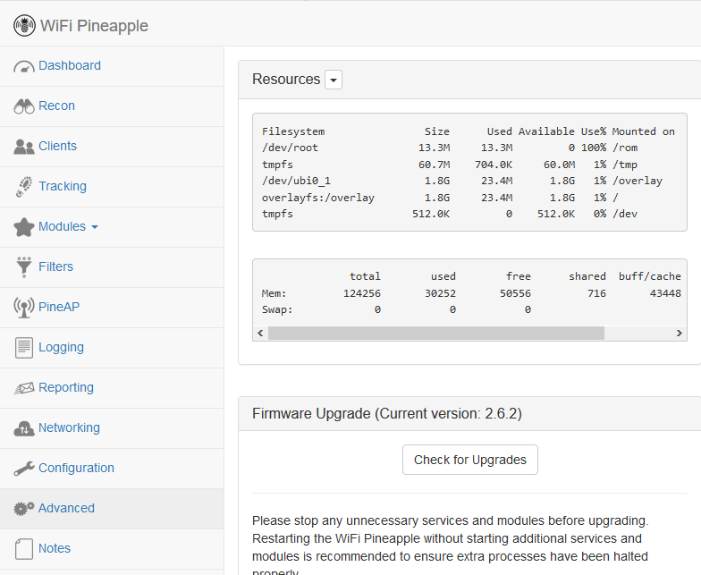
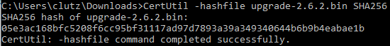
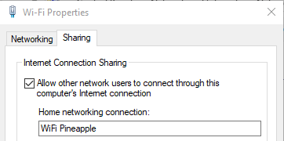
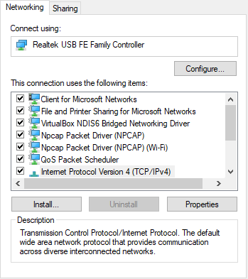
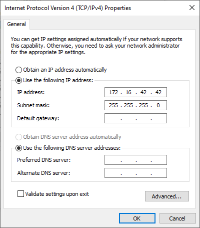
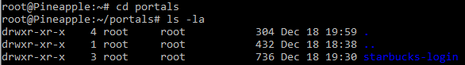
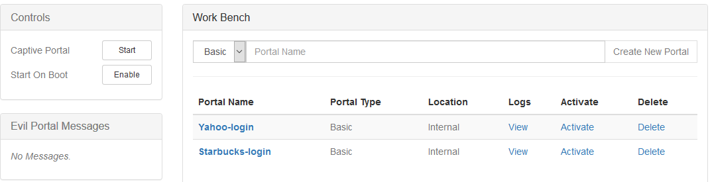
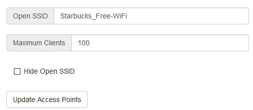
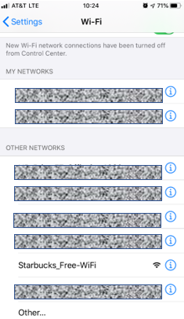

# Nifty Assignment - WiFi Pineapple TETRA

## Background

The WiFi Pineapple is a powerful penetration testing tool that began development in 2008. The WiFi Pineapple may be utilized to gather network intelligence, target and track Wi-Fi devices, and may even be deployed as a rogue access point. Functionality of the WiFi Pineapple is largely dependent on third-party modules that are written and maintained by community members—Hak5, the company behind the WiFi Pineapple, does not maintain responsibility for the modules even though staff work to assist in continuity in times of updates.
Since development began in 2008, the Wi-Fi Pineapple has undergone several iterations. The two most recent versions are the WiFi Pineapple NANO and the WiFi Pineapple TETRA. Differences between the two devices are outlined below:

|WiFi Pineapple TETRA | WiFi Pineapple NANO |
| --------- |-------------|    
|Dual Band 2.4/5 GHz |	Single Band 2.4 GHz |
Four Antennas, Up to 800mW per radio |	Two Antenna, up to 400mW per radio |
USB Ethernet, USB Serial, USB Host, & Ethernet Ports |	USB Ethernet Plug, USB Host Port |
2 GB NAND Flash memory |	MicroSD Expansion |
Power via USB or DC |	Power via USB |

## Meta Information

| Attribute | Description |
| --------- |-------------|
|Summary | WiFi Pineapple TETRA—Install and edit a Pineapple module which is usable in penetration testing and may be modified to replicate known sign-on portals.    |
| Topics | Hak5, WiFi Pineapple TETRA, PHP, HTML, CSS, Penetration testing   |
|Audience |High School Seniors with an interest in information technology and penetration testing.  |
| Difficulty | This is designed to be an introduction to one popular module for the WiFi Pineapple. Students with limited experience with PHP and HTML may have a steeper learning curve in modifying the portal.    |
|Strengths | Introduction to and experience in utilizing a modern technological gadget that may be utilized in penetration testing.     |
| Weaknesses | It may be difficult to capture traffic through the Packet Squirrel on a machine connected to WiFi. Some machines may throw an error reporting an unsecure network.   |
| Dependencies | WiFi Pineapple, Reliable USB Power Source, Reliable Internet, Test Device |
| Variants | There are several different community-maintained payloads that may be installed on the WiFi Pineapple and enhance the functionality of the device.  |

### Additional Descriptions
|   |   |
|------------|----------|
|Assignment Description | This project is meant to be a hand on practical example of a popular penetration testing tool and a functional module, Evil Portal.   |
|Structure Description |The assignment is structured to guide the student through setting up the WiFi Pineapple TETRA, installing the Evil Portal module, importing template portals, and reviewing ‘stolen’ credentials. |
| How it Works Description |The WiFi Pineapple may be deployed as a rogue access point; utilizing Evil Portal, the focus of this primer, the Pineapple can be used to mimic trusted ‘free’ and open wi-fi and capture user credentials.  |


## Target Audience

### WiFi Pineapple TETRA

While the majority of the options will be similar across the TETRA and the NANO, this assignment has been created for the WiFi Pineapple TETRA. Instructions may differ if being attempted on the Pineapple NANO due to the slimmer design and MicroSD expansion requirement to compensate for low internal storage.

### Operating System: Windows

This primer is written and intended for Windows machines, specifically Windows 10. Instructions may differ on older versions of Windows or alternative operating systems such as Mac or Linux. If on a device utilizing something other than Windows this primer may still be read for concept even though configuration settings will be different.

## Getting Started

### Upgrading Firmware
It’s important to upgrade the firmware to achieve optimal performance both with the device and in module operations. To upgrade the firmware, follow the below directions:
1. Download the latest firmware from the Hak5 website at https://www.wifipineapple.com/downloads and verify the checksum.
2.	Use the provided USB-Y adapter to connect from the ETH1 port on the Pineapple to a computer.
3.	From Chrome or Firefox, browse to http://172.16.42.1:1471
4.	Follow the onscreen instructions to complete the firmware upgrade.
  * Onscreen instructions will instruct you to browse and select the firmware upgrade file downloaded and will prompt setup of establishing the root user password, Open SSID, & other functionality settings. Settings may be adjusted later from the menu.
  * If the WiFi Pineapple has been previously used and does not prompt for an update, ensure internet connectivity and navigate to the ‘Advanced’ menu and select “Check for Upgrades.”
  

### Verify Firmware Version   
1.	From the ‘Advanced’ tab above the “Check for Upgrades” button the Current version will be identified. Compare the version number stated with the website at https://www.wifipineapple.com/downloads#tetra.

### Verify Checksum (Optional)
Checking the hash file of downloads is important to ensure that the file downloaded is the same as an untampered file as intended by developers and has not been corrupted. If a file has been altered by a third party the hash value will be different from the value provided by the developer. Verifying a hash value may be considered a weak form of data integrity as verification does not verify the file origin. None the less, verifying hash values where available is good practice. The way outlined is merely one of many ways in which checksum may be verified:
1.	Open Command Prompt.
2.	Navigate to where the file is downloaded.
3.	Run the command, “CertUtil -hashfile upgrade-2.6.2.bin SHA256.”
  ```
  CertUtil -hashfile upgrade-2.6.2.bin SHA256
  ```
  * 
4.	Compare the hash of the downloaded file against the hash supplied by the developer.
  * 
In this case, the downloaded and anticipated checksums match.

### Internet Sharing
There are four main methods Hak5 identified to setup internet on the WiFi Pineapple. The instructions below serve to guide through Internet Connection Sharing for lab purposes. Methods of setup include:
* Wired Internet Connection
* Internet Connection Sharing
* USB Tethering from Android
* WiFi Client Mode  

### Internet Connection Sharing
1.	Connect the WiFi Pineapple TETRA to the PC via the USB-Y adapter.
2.	Navigate to the “Network Connections” Control panel by typing “ncpa.cpl” into the search bar or through the menus.
  * 
3.	Identify your current Wi-Fi connection and the connection from the WiFi Pineapple.
4.	On the active connection being received by the PC right click and select properties.
5.	Select the ‘Sharing’ tab and check the box for “Internet Connection Sharing.” In the drop-down box select the WiFi Pineapple connection. Select OK.
  * 
6.	On the WiFi Pineapple Connection right click and select properties.
7.	Choose IPv4 from the list and press ‘Properties.’
  * 
8.	Manually set the IP address to “172.16.42.42” and leave the Subnet mask as the default. Press OK.
  * 
9.	Navigate to the WiFi Pineapple web client from Firefox or Chrome by browsing to http://172.16.42.1:1471 and sign-in using the Root password. From the Dashboard, select “Load Bulletins from Hak5” to verify internet connectivity. If the bulletins to not load then the WiFi Pineapple TETRA is not connected to the internet and does not have full functionality.
10.	If the WiFi Pineapple TETRA has difficulty connecting try these steps again by disallowing the connection sharing, re-establishing the connection, and re-setting the static IP on the WiFi Pineapple.  

## Assignment Instructions
The assignment steps below will walk you through installing Evil Portal, cloning portals from kbeflo, and connecting with an external device to test the portal on your own device. Following the assignment, modify the code to make it your own or use it as a template for creating your own captive portal.
### Install Evil Portal
1.	From Firefox or Chrome browse to http://172.16.42.1:1471 & ensure internet connectivity.
2.	Click the modules tab on the left side, Manage Modules, and “Get Modules from Hak5 Community Repository” at the top of the screen.
3.	Click Install on Evil Portal by newbi3 and select Install Internally when prompted.
4.	From the left side Modules dropdown select Evil Portal.  
### Clone kbeflo Portals
1.	Open the command prompt and clone the GitHub repository maintained by kbeflo by using the command “git clone https://github.com/kbeflo/evilportals.”
2.	Navigate into the folder created.
    ```
      Cd evilportals/portals
    ```
3.	Open another command prompt and SSH into the WiFi pineapple using “ssh root@172.16.42.1.” Return to the original command prompt.
4.	Identify the portal you wish to utilize; in this example it will be the Starbucks portal. Copy the directory to the WiFi Pineapple.
  ```
  scp -r starbucks-login root@172.16.42.1:/root/portals/
  ```
5.	From the SSH session, use ‘cd portals’ and ‘ls -la’ to view the list of portals.
  * 

### Activate Portal

1.	From the WiFi Pineapple browser dashboard navigate to the Evil Portal module and select activate on the portal and click start from the control panel.
  * 
2.	You can preview the portal from the browser by expanding the ‘Live Preview’ tab.

### Connect to Device
1.	From the Networking tab in the browser, modify the Open SSID. For this example we used “Starbucks_Free-WiFi.” Ensure that the box to hide the open SSID is unchecked and select “Update Access Points.”
  * 
2.	From your test device, you may connect to the access point and put in a set of test credentials.
  * 
  * 


## Model Grading Criteria
Upon successful completion of this assignment the student should have successfully deployed the WiFi Pineapple TETRA and a captive portal within the ‘Evil Portal’ module. The student should have modified the code to personalize their portal as well as demonstrated competence in navigating the command directory.  

## Additional Information
This primer paper does not include all of the options involved in using the WiFi Pineapple. For more information about the WiFi Pineapple TETRA, the following community resources may be useful:
* Hak5 site directory (https://shop.hak5.org/products/wifi-pineapple)
* WiFi Pineapple wiki (https://docs.hak5.org/hc/en-us/categories/360000979333-WiFi-Pineapple)
* Hak5 WiFi Pineapple Forums (https://forums.hak5.org/forum/91-wifi-pineapple-tetra/)
* Kbeflo GitHub for evilportals (https://github.com/kbeflo/evilportals)
